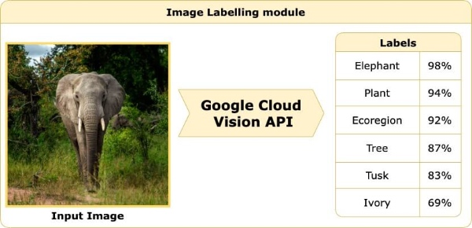
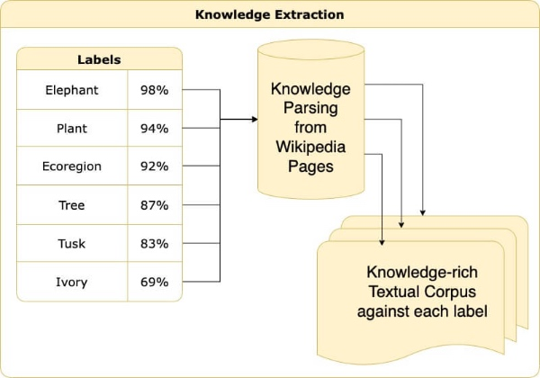
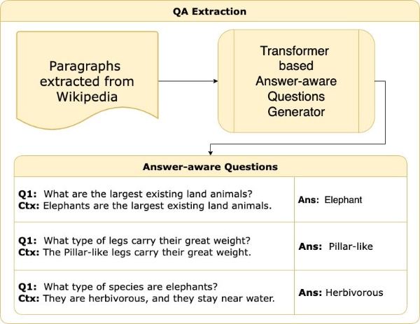
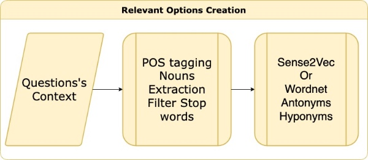
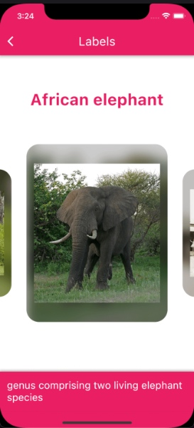
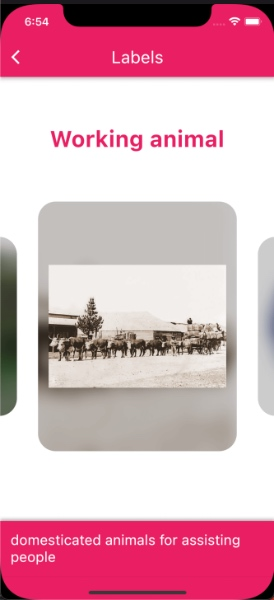
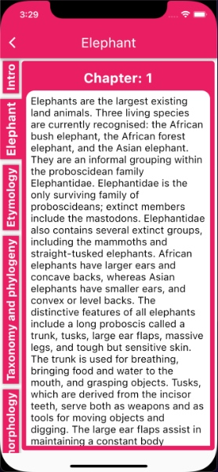
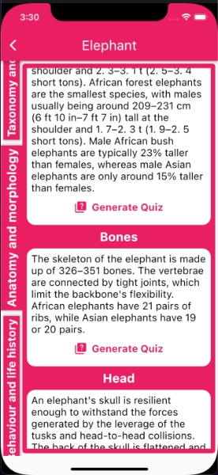
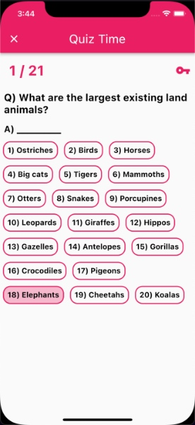
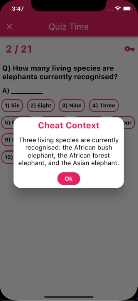

# Knowledge Aware Visual Question Answering Framework for developing visual learning apps for children

This project contains a server developed on python3 using FastAPI which is capable of generating multiple knowledge-aware, open-ended and free-formed MCQs from a single image. It also contains a mobile app developed on flutter which interacts with the server to help the children in learning by generating automated quizzes on their favorite topics.


## Architecture

The proposed architecture can be divided into four modules


##### 1. Image Labelling

This module is responsible for labelling the image using Google Cloud Vision.




##### 2. Knowledge Parsing

This module is responsible for parsing the knowledge from Wikipedia.



##### 3. Questions Answers Extraction

This module is responsible for extracting the answer-aware questions using Google's T5 model fine-tuned on SQuAD dataset.



##### 4. Relevant Options Creation

This module is responsible for generating relevant options using Sense2Vec to convert simple Questions into MCQs.




## Step-One: A Visual Learning App

Using the proposed framework, we were able to develop a visual learning app for children with the following screens.

##### 1. Image Input Screen

This module is responsible for labelling the image using Google Cloud Vision.

 


##### 2. Topic Selection Screen

This module is responsible for parsing the knowledge from Wikipedia.

 

##### 3. Reading Screen

This module is responsible for extracting the answer-aware questions using Google's T5 model fine-tuned on SQuAD dataset.

 

##### 4. Quiz Screen

This module is responsible for generating relevant options using Sense2Vec to convert simple Questions into MCQs.

 

##### 5. Score Screen

This module is responsible for generating relevant options using Sense2Vec to convert simple Questions into MCQs.

 

## Installation


##### Environment
To setup the environment, run:
```sh
cd QuizApp/server
python3 -m venv env
source env/bin/activate
pip install -r requirements.txt
export GOOGLE_APPLICATION_CREDENTIALS="/[project_location]/QuizApp/server/keyFile.json"
```

##### Dependencies
To install dependencies:

```sh
pip3 install sense2vec
pip3 install -U pip setuptools wheel
pip3 install -U spacy
python3 -m spacy download en_core_web_sm

pip3 install spacy-wordnet
python3 -m nltk.downloader wordnet

python -m spacy download en_core_web_sm
pip3 install -e git://github.com/ahmedjamshed/question_generation.git@0.4.0#egg=question_generation

```

##### Download sense2vec
If you haven't previously downloaded the sense2vec data then download it using [dloader.py](./server/dloader.py)

```sh
python3 dloader.py
```

##### Server
You need to first run the server locally using uvicorn 

```sh
cd server
uvicorn main:app --reload --workers 1 --host 0.0.0.0 --port 8008
```
OR
you can also use this colab notebook which uses ngrok to generate the temporary endpoint.

[](https://colab.research.google.com/gist/ahmedjamshed/1c8663cd4f24748eaf96a0b5bedd54de/quizappserver.ipynb)

##### Step-One app

Make sure server endpoint is updated in [constants.dart](./lib/app/common/constants.dart)

```sh
flutter run
```

##### Output

This framework will generate the following output considering this image of lion.


| Topic | Question | Answer | Options |
| :-----: | :-: | :-: | :-: |
| Carnivora | What is the fifth largest order of mammals? | ______ | Acanthopterygii, Acarina, Actiniaria, **Carnivora**, Actinomyxidia etc. |
| Lion | What are the biggest causes of the decline of the lion? | habitat loss and conflicts with ____| other species, living things, **humans**, intelligent beings, sentient species etc.|
| Snout | What is the rhinarium associated with? |  ______ sense of olfaction | same strength, stonger, tougher, **stronger**, weaker, more endurance etc..|

## License

MIT
